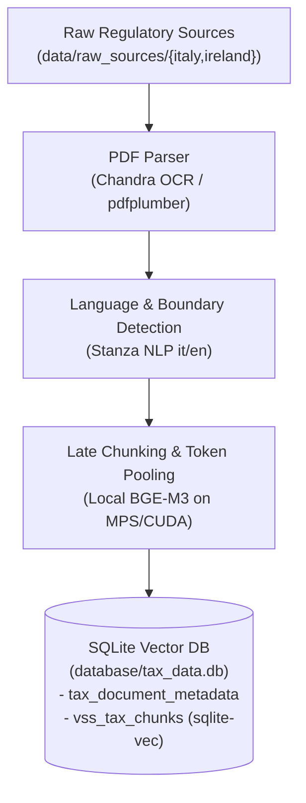
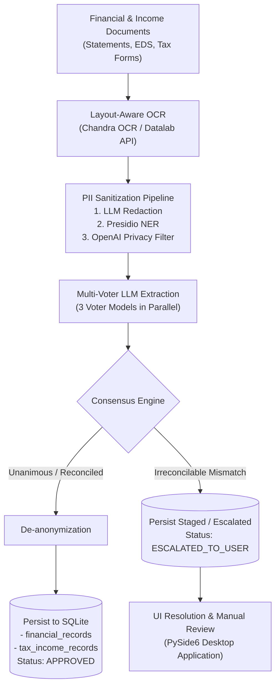
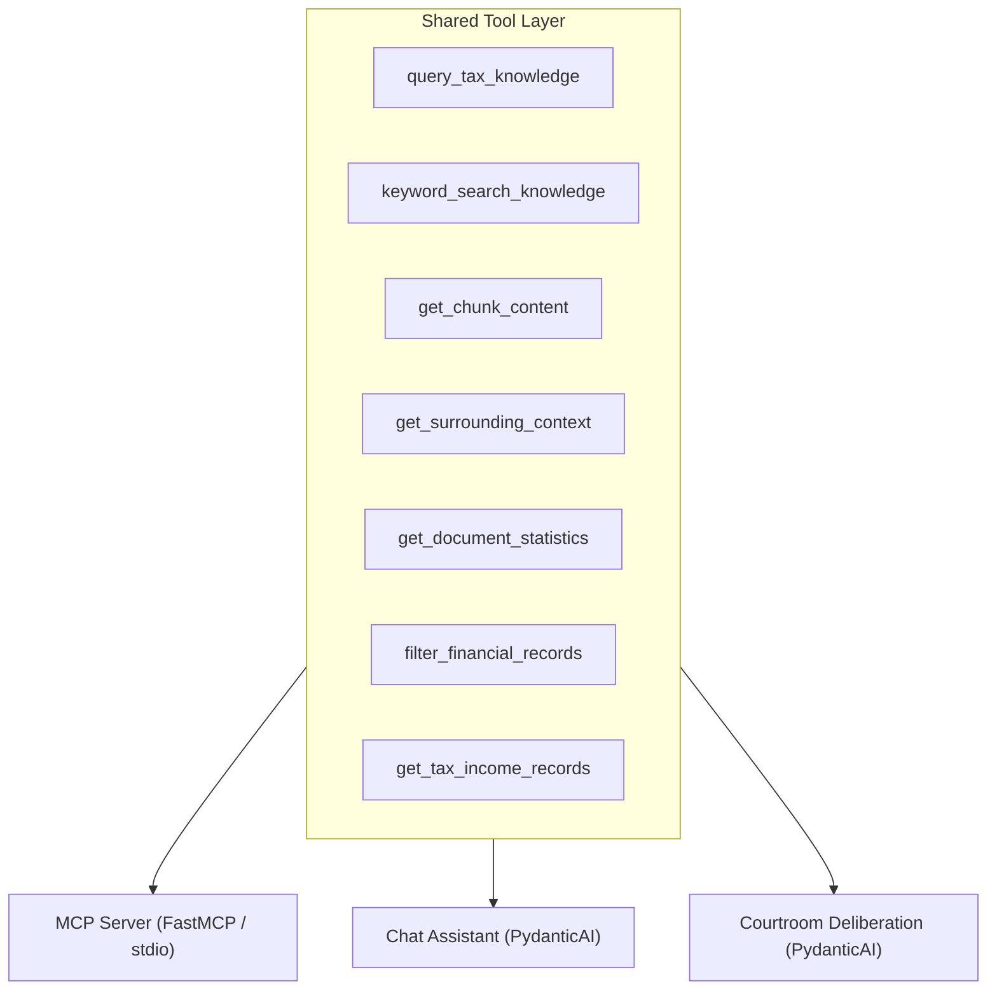

# 🏗️ Tax-Return-AI Architecture

This document describes the high-level architecture, pipelines, data structures, and tool layer for the Tax-Return-AI platform.

---

## 1. Regulatory Documents Ingestion Pipeline

Ingests regulatory PDFs and manuals (e.g. Italian TUIR, Irish Revenue manuals) into vector embeddings with Late Chunking.

---

## 2. Financial & Income Records Ingestion Pipeline

Ingests financial broker statements (Directa, Interactive Brokers) and official tax income summaries (Irish Revenue EDS, Italian CU) with automated PII sanitization and multi-voter LLM consensus.

---

## 3. Tool, MCP, & Agent Deliberation Layer

Provides a unified tool registry shared across PydanticAI chat agents, courtroom deliberation agents, and MCP clients.

